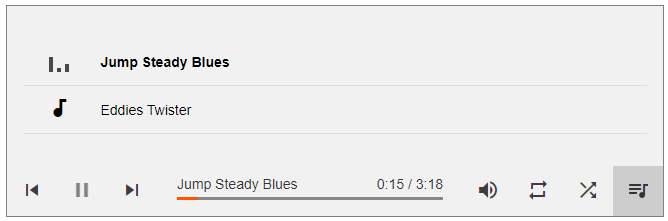
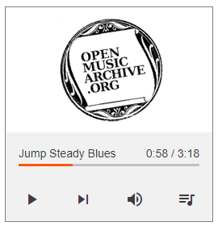

# A Better Audio Player for HTML5 - BetterAudio.js

Features:
- Unified, predictable look for HTML audio elements across browsers
- Use CSS to style your audio element
- Manage playlists
- Javascript API (under construction)

TODO:
- Extend API
- Optimize code
- tbd

## Intro

Original Codepen: http://codepen.io/k-ivan/pen/pJMLmJ by @k-ivan  
Original fork: https://github.com/likev/html5-audio-player by @likev  

Major changes to original fork (May 2021):
- Renamed to 'BetterAudio.js'
- Refactured code to enable multiple player instances on same HTML page
- Scoped CSS within `.better-audio` class
- Added resize observer to player element to set CSS classes 'ba-large', 'ba-medium', 'ba-small', 'ba-tiny'
- Style optimizations




## Quick Start

1. insert Google Material Icons and BetterAudio.css before `</head>`
2. insert BetterAudio.js before `</body>`
3. use BetterAudio.newPlayer function

code example:
```html
<!DOCTYPE html>
<html >
  <head>
    <meta charset="UTF-8">
    <title>Better Audio Player HTML5</title>
    <meta name="viewport" content="width=device-width, initial-scale=1">

	<!-- required -->
    <link href="https://fonts.googleapis.com/icon?family=Material+Icons" rel="stylesheet">
    
	<!-- import BetterAudio -->
	<link rel="stylesheet" href="css/BetterAudio.css">
	<script src="js/BetterAudio.js"></script>
    
	<style>
		#player{
			position: relative;
			max-width: 700px;
			height: 500px;
			border: solid 1px gray;
		}
    </style>
  </head>

  <body>
    <!-- BetterAudio container-->
    <div id='player'></div>

    <script>
        // test image for player and web notifications
        var iconImage = null;

		// create player
        BetterAudio.newPlayer({
            container: '#player', //a string containing one CSS selector
            volume: 0.7,
            autoPlay: true,
            notification: false,
            playList: [
                {icon: iconImage, title: "Jump Steady Blues", file: "http://www.openmusicarchive.org/audio/Jump_Steady_Blues.mp3"},
                {icon: iconImage, title: "Eddies Twister", file: "http://www.openmusicarchive.org/audio/Eddies_Twister.mp3"}
          ]
        });
    </script>

  </body>
</html>
```

Have fun! :-)
